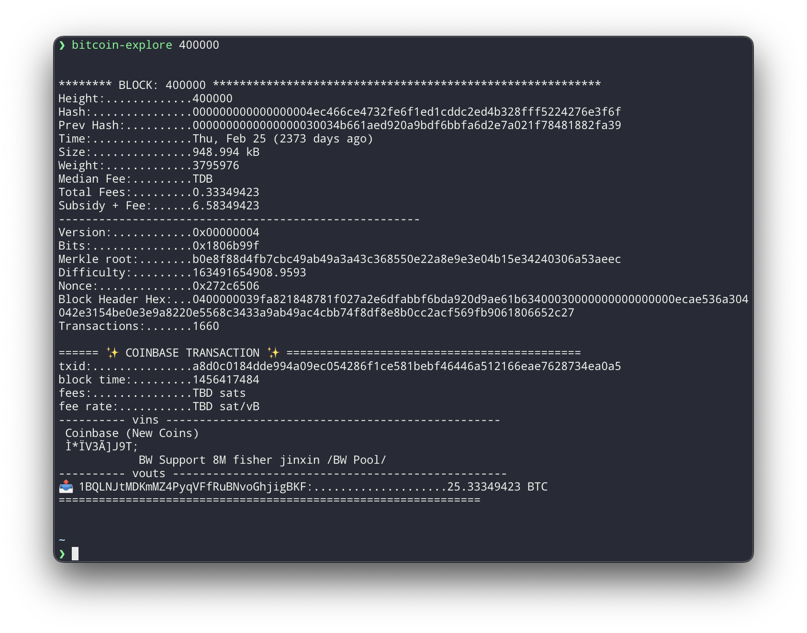

☠️⚠️ Work In Progress ⚠️☠️

# Bitcoin Explore
> Explore the Bitcoin Blockchain in the Terminal



Get information about a block or transaction, quickly and easily right from your terminal.

## Install
> Add package to Cargo.toml file
```shell
$ cargo install bitcoin-explore
```

## Setup:
> Must have these environment variable set for the terminal to work. Could go in your `.zshrc`, `.bashrc`, or set when running the script.
```shell
export BITCOIND_PASSWORD="..." 
export BITCOIND_USERNAME="..." 
export BITCOIND_URL="127.0.0.1:8332"
```
> when running the script...
```shell
 BITCOIND_PASSWORD=... BITCOIND_USERNAME=...BITCOIND_URL=... bitcoin-explore 400000
```

## Usage
```shell
 $ bitcoin-explore <blockhash|blockheight|txid>
```

## Examples
> get block at height 400,000
```shell
 $ bitcoin-explore 400000
```
> get block with hash
```shell
 $ bitcoin-explore 00000000000000000008f1856244c2a991063b5f4a2d86a5f3935341ae508b8a
```
> get transaction with hash
```shell
 $ bitcoin-explore 4a20c13b5fa0a867bcc2d99834f11bb0e36ea683cd4c7310b1f12c51ccf3ccca
```

## Related
- [bitcoin-terminal-dashboard](https://github.com/joegesualdo/bitcoin-terminal-dashboard) - Bitcoin Dashboard in the terminal
- [bitcoind-request](https://github.com/joegesualdo/bitcoind-request) - Type-safe wrapper around bitcoind RPC commands
- [bitcoin-node-query](https://github.com/joegesualdo/bitcoin-node-query) - Query information about the bitcoin network

## License
MIT © [Joe Gesualdo]()

